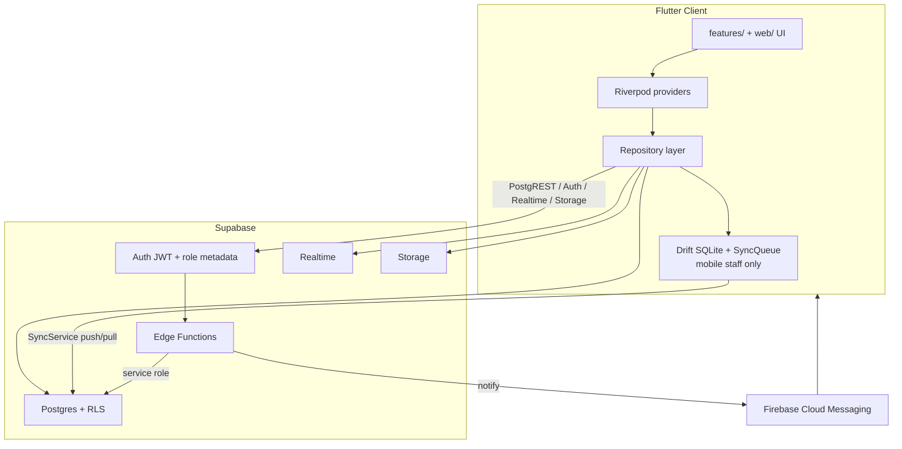

# AUDIT_INVENTORY — BusinessSajilo

**Date:** 2026-07-09  
**Project:** BusinessSajilo  
**Stack:** Flutter (Android / iOS / Web / Windows) + Riverpod 3 + Drift/SQLite + Supabase (Postgres, Auth, Realtime, Storage, Edge Functions) + FCM  
**Repo:** `c:\Users\sudip\Desktop\Projects\businesssajilo`

---

## 1. Project structure

| Path | Purpose |
|------|---------|
| `lib/` | All Dart application code |
| `lib/core/` | Theme, l10n, router, shared UI, invoicing, export, config |
| `lib/domain/` | Freezed models + enums (no use-case services) |
| `lib/data/local/` | Drift SQLite schema + mappers |
| `lib/data/remote/` | Supabase-specific repository implementations |
| `lib/data/repositories/` | Abstract interfaces + Riverpod wiring (~16 repos) |
| `lib/data/sync/` | Offline queue, merge, syncing/cached decorators |
| `lib/features/` | Mobile screens + feature providers (auth, billing, orders, …) |
| `lib/web/` | Web-only pages, layout, theme, router (mirrors features) |
| `supabase/` | Migrations, seed, RLS pgTAP tests, Edge Functions |
| `android/`, `ios/`, `web/`, `windows/` | Platform shells |
| `test/` | Unit/widget tests (~36 Dart files) |
| `integration_test/` | Device/web integration tests |
| `scripts/` | Dev helpers (`run_dev.ps1`, integration/e2e scripts) |
| `docs/` | Security + release docs |
| `.github/workflows/` | CI + release pipelines |

**Not present:** `linux/`, `macos/`, dedicated `backend/` (backend lives under `supabase/`).

---

## 2. Entry points

| Entry | Path | Role |
|-------|------|------|
| Bootstrap | `lib/main.dart` | Binding, env check, PushService, Supabase init, `ProviderScope` |
| Root widget | `lib/app.dart` | `MaterialApp.router`, theme/locale, push handlers |
| Router switch | `lib/core/router/router_provider.dart` | Web if `kIsWeb \|\| Env.forceWebUi`, else mobile |
| Mobile routes | `lib/core/router/mobile_router.dart`, `role_routes.dart` | Role-aware flat routes + shells |
| Web routes | `lib/web/router/web_router.dart`, `web_role_routes.dart` | Nested URL routes, role shells |
| Web HTML | `web/index.html` | Loads `flutter_bootstrap.js` |
| Android / iOS / Windows | Platform runners under `android/`, `ios/`, `windows/` | Standard Flutter hosts |

---

## 3. Config & build tooling

| File | Purpose |
|------|---------|
| `pubspec.yaml` / `pubspec.lock` | Dependencies; SDK `^3.11.5`; `generate: true` for l10n |
| `analysis_options.yaml` | Includes `package:flutter_lints/flutter.yaml` only |
| `l10n.yaml` | ARB → `lib/core/l10n/` |
| `build.yaml` | `json_serializable`: snake_case, `explicit_to_json` |
| `.env.example`, `.env.prod.example` | Local / prod dart-define templates |
| `lib/core/config/env.dart` | Secrets via `String.fromEnvironment` / `bool.fromEnvironment` |
| `vercel.json` | SPA rewrite → `index.html` |
| `supabase/config.toml` | Local Supabase stack |
| `.github/workflows/ci.yml` | Analyze, test, gen-l10n, build_runner, Supabase RLS, web build on main |
| `.github/workflows/release.yml` | Tag-based web + AAB, Vercel deploy |

**Build commands:** `flutter pub get`, `flutter analyze`, `flutter test`, `flutter build web/appbundle`, `dart run build_runner build`, `flutter gen-l10n`, `supabase start` / `db reset` / `test db`.

---

## 4. Architecture pattern

**Hybrid: layered clean architecture + feature modules + parallel web presentation.**

Documented in `Architecture.md`. Evidence:

- Repository abstraction with dual impl (e.g. `SyncingBillsRepository` vs `SupabaseBillsRepository` via `syncBundleProvider`).
- Offline only for mobile staff: `syncEnabledFor()` in `lib/data/sync/sync_config.dart` returns false for web and customer role.
- Feature folders own UI + providers; `lib/web/` is a separate presentation layer reusing domain/data.
- Role shells: `lib/features/shell/`, `lib/web/shell/`.

**Implicit gap:** `Architecture.md` describes an application / use-case layer; `lib/` has no such folder — screens call repositories directly.

---

## 5. Major dependencies

| Package | Constraint | Notes |
|---------|------------|-------|
| `flutter_riverpod` | ^3.3.2 | Primary state management |
| `go_router` | ^17.3.0 | Routing |
| `supabase_flutter` | ^2.14.2 | Backend client |
| `drift` / `drift_flutter` | ^2.34.0 / ^0.3.0 | Offline SQLite |
| `firebase_core` / `firebase_messaging` | ^4.1.1 / ^16.0.2 | Push |
| `freezed` / `json_serializable` | codegen | Domain models |
| `connectivity_plus` | ^6.1.4 | Sync trigger |
| `pdf` / `printing` / `share_plus` | invoice export | |
| `google_fonts` / `phosphor_flutter` | UI | |
| `nepali_utils` / `intl` | BS dates / i18n | |
| `cached_network_image`, `image_picker`, `uuid`, `shared_preferences`, `path_provider`, `package_info_plus`, `flutter_animate` | Supporting | |

**Dev:** `flutter_lints`, `build_runner`, `freezed`, `json_serializable`, `drift_dev`, `integration_test`.

### Dependency flags

| Flag | Status |
|------|--------|
| Unused packages | No obvious unused deps from spot-check (all major packages referenced). Full unused-dep analysis not run. |
| Duplicate / overlapping libs | None severe. Web/mobile UI duplication is source duplication, not package overlap. |
| Outdated / deprecated | Audited 2026-07-09 — see [docs/DEPENDENCIES.md](docs/DEPENDENCIES.md) (backlog N5). |
| Known CVEs | Not scanned in this pass. Recommend advisory check after major bumps; see DEPENDENCIES.md. |

---

## 6. State, data, and config flow

1. **Startup:** `main.dart` reads `Env` dart-defines → Supabase (+ optional Firebase).
2. **Auth:** `AuthRepository` → members row → `SessionState` with `Role`.
3. **Online path:** UI → Riverpod → repository → Supabase.
4. **Offline staff path:** Drift + `SyncQueue`; connectivity-triggered push/pull with watermarks.
5. **Security:** Postgres RLS; Edge Functions use service role for privileged ops.
6. **Push:** notifications → Edge `notify` → FCM → client.

---

## 7. Project hygiene

| Item | Status |
|------|--------|
| README | Present (`Readme.md`) |
| `.env.example` | Present (+ `.env.prod.example`) |
| Lint config | Minimal — stock `flutter_lints` only |
| Format enforcement | Missing — no `dart format` in CI |
| CI | Present — analyze, unit tests, Supabase RLS, web build on main |
| Tests | Partial — ~36 unit/widget tests; 1+ integration test; no coverage gate; integration not in CI |
| `build_runner` in CI | `continue-on-error: true` (codegen failures do not fail CI) |
| Firebase config | Optional dart-defines; web FCM SW is stub |
| Secrets in repo | Examples only; prod via GitHub secrets / dart-defines |

---

## 8. Key file reference

| Area | Paths |
|------|-------|
| App | `lib/main.dart`, `lib/app.dart` |
| Config | `lib/core/config/env.dart`, `pubspec.yaml` |
| Auth | `lib/features/auth/providers/auth_provider.dart`, `lib/data/repositories/auth_repository.dart` |
| Offline | `lib/data/local/app_database.dart`, `lib/data/sync/sync_service.dart`, `sync_providers.dart` |
| Domain | `lib/domain/enums.dart`, `lib/domain/models/` |
| Backend | `supabase/migrations/`, `supabase/functions/`, `supabase/tests/` |
| Docs | `Readme.md`, `Architecture.md`, `docs/SECURITY.md` |
